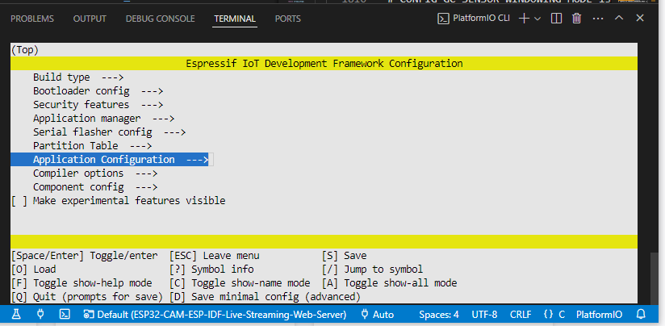

# ESP32-CAM-ESP-IDF-Live-Streaming-Web-Server

For details visit this link:
https://esp32tutorials.com/esp32-cam-esp-idf-live-streaming-web-server/

# Configuration

Open a [PlatformIO Core CLI](https://docs.platformio.org/en/latest/integration/ide/vscode.html#platformio-core-cli) and execute
```
pio run -t menuconfig
```

to enter the menuconfig. Select your target WiFi and camera board type in the "Application configuration".

(move around with J/K keys if needed.)



The default ist `CONFIG_BOARD_ESP32CAM_AITHINKER` (esp32cam). Double check the pins in `camera_pins.h` if needed.

After the example is uploaded, it should connect to the configured WiFi and open a HTTP server at `http://<ip of your esp32>/`.

Your board should have PSRAM to interact with a camera. Hence, `CONFIG_SPIRAM=y` is on.

Component config  --->ESP PSRAM  --->SPI RAM config  --->Enable workaround for bug in SPI RAM cache for Rev1 ESP32s  must be cancel, or it will cuase error.
